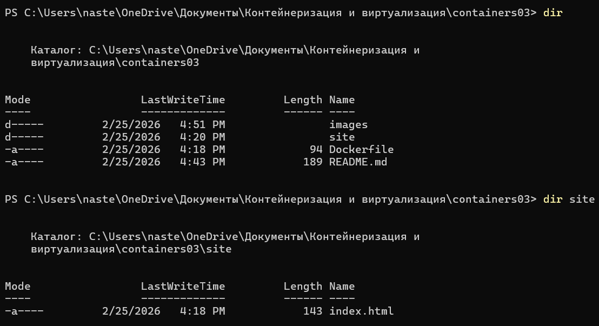
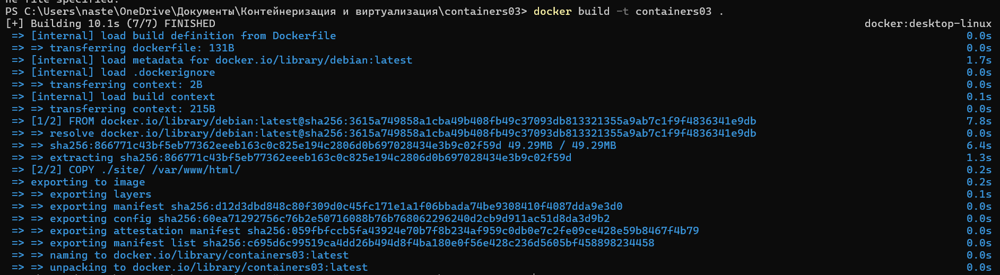
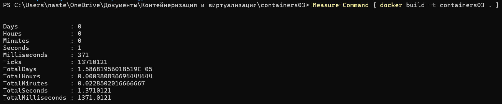
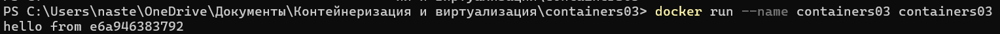
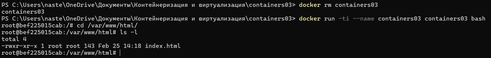

# Лабораторная работа №3: Первый контейнер

**Каварналы Анастасия, IA2403** 

**Дата:** 25.02.2026

## Цель работы:
Ознакомиться с  основами контейнеризации и подготовить рабочее место для выполнения следующих лабораторных работ

## Задание
Установить Docker Desktop и проверить его работоспособность

## Ход работы

### 1) Подготовка
Установлен Docker Desktop. Проверка работоспособности выполнена командами `docker --version` или `docker version`


### 2) Создание проекта
Создан репозиторий `containers03`. В корне проекта создан `Dockerfile`, а также папка `site` с файлом `index.html`



Dockerfile:

```dockerfile
FROM debian:latest
COPY ./site/ /var/www/html/
CMD ["sh", "-c", "echo hello from $HOSTNAME"]
```

## Запуск и тестирование

### 1.1 Сборка образа

```powershell
docker build -t containers03 .
```


### Как получить время сборки (ответ на “Сколько времени создавался образ?”)

Запустила в PowerShell в папке containers03:

```powershell
Measure-Command { docker build -t containers03 . }
```
**Ответ:** время сборки(значение TotalSeconds)



### 1.2 Запуск контейнера (ответ “Что было выведено в консоли?”)

Я запустила:

```powershell
docker run --name containers03 containers03
```
**Ответ:** в консоли выведено hello from <HOSTNAME>:



### 1.3 Удаление и запуск с bash

```powershell
docker rm containers03
docker run -ti --name containers03 containers03 bash
```

Внутри контейнера:

```bash
cd /var/www/html/
ls -l
```

**Ответ:** отображается файл index.html в `/var/www/html/`



Завершение работы:

```powershell
exit
```

## Выводы

В ходе лабораторной работы установлен и запущен Docker Desktop, подтверждена его работоспособность через выполнение команд Docker. Создан проект `containers03`с `Dockerfile` и тестовой HTML-страницей, собран Docker-образ и проверено время сборки. Контейнер успешно запускается, выводит сообщение в консоль и содержит скопированный файл `index.html` в каталоге `/var/www/html/`, что подтверждает корректную сборку образа и работу команд `docker build` и `docker run`

## Библиография

1. Курс Moodle "Контейнеризация и Виртуализация"
   [https://elearning.usm.md/course/view.php?id=6806](https://elearning.usm.md/course/view.php?id=6806)
2. Docker Desktop — установка (Windows)
   [https://docs.docker.com/desktop/setup/install/windows-install/?utm_source=chatgpt.com](https://docs.docker.com/desktop/setup/install/windows-install/?utm_source=chatgpt.com)
3. Chat GPT
   [https://chatgpt.com/](https://chatgpt.com/)